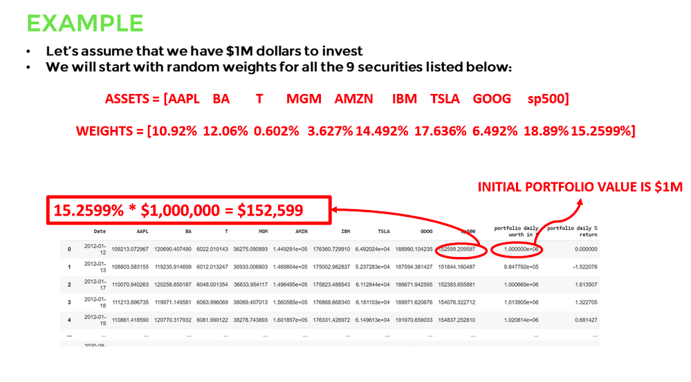

# Portfolio Assets Allocation and Statistical Data Analysis
## Introduction
In this project, instead of analysing individual stocks, we will create function to perform portfolio analysis such as calculating portfolio returns, risk and Sharpe ratio. A portfolio is a collection of financial investments such as stocks, fixed income securities (bonds), cash, mutual funds and Exchange Traded Funds (ETFs).

Lets assume that you have $1M to invest in the market, how can you allocate these assets among a selected set of securities? 
Should you invest them all in Apple? S&P500? Bonds?
The answer depends on many factors such as clients risk tolerance, target returns and investment time span.

##  TYPES OF ASSETS: 1.  EQUITIES (STOCKS): 

* A stock simply represents an ownership of a certain percentage of a company. 
* A stock gives the owner the right to some shares in a given companydepending on how much stock (shares) theyown. 
* Stocks are traded on stock exchanges such as New York Stock Exchange (NYSE) and regular individuals can buythem via online brokerage firms. 
* Stocks are generally liquid as compared to real estate which could takea much longer time to sell. 

## TYPES OF ASSETS: 2. FIXED INCOME SECURITIES (BONDS) 

* A bond is a fixed income that are generally issued by governments or corporations and represents a loan made by an investor to the borrower. 
* Bonds pay the investor a fixed stated interest rate. 
* Bonds are used by companies and Governments to raise money to fund future projects. 
* Bonds that are less risky such as U.S. Government Bonds pay less interest compared to high risk bonds.
* Bond coupons represent a semi-annual interest payments to the bond holder. 
* Here's a 1945 2.5% $500 Treasury Bond coupon as an example: 

## TYPES OF ASSETS: 3. EXCHANGE TRADED FUNDS (ETFs) 

* ETFs are a type of security that includes a group of securities and possibly track an index such as the S&P500.
* ETFs are like mutual funds however they are marketable securities and are being traded on exchanges similar to any other stock. 
* ETFs can include a collection of stocks, bonds, and commodities. 
* ETFs have generally low management fees and offer a tool for risk diversification. 
* Vanguard S&P 500 ETF (V00),
 https://investormanguard.comietf/profile/performance/voo 

## ASSET ALLOCATION 

* Asset allocation is an investment strategy that is used to allocate client's assets based on their risk tolerance, target returns and investment time span.
* The goal of portfolio managers is to maximize returns and reduce risks. 
* There are many asset classes such as: Equities (stocks) Fixed income securities (Bonds) Cash and equivalents Exchange Traded Funds Real estate Commodities.
* Lets take a look at an example: 
